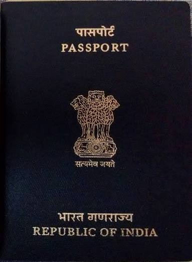

# Passport Seva Prototype (Safar Ledger)
> A citizen-first redesign of the Indian passport application journey.

Built for the **"Build What Moves India"** Hackathon (OpenAI / Codex Initiative).



## 🚀 Overview
**Passport Seva Prototype** addresses the most stressful part of applying for or renewing an Indian passport: moving from *"I need a passport"* to *"I know exactly what I need, where I am in the process, what I have paid for, and what I must bring to my appointment."*

Most passport-portal redesigns focus on how the interface looks. This one focuses on whether its trust claims can actually be checked. Every core promise — privacy, payment safety, document validity — is verifiable in the browser itself, not just asserted in copy. Open DevTools, inspect the Live Data Vault, watch the payment recovery state hold under a simulated failure. Nothing here asks for your trust; it earns it.

### Key Features
1. **Dynamic, Scenario-Aware Checklists**: Automatically tailors document requirements based on applicant circumstances (Fresh/Renewal, Marital/Name change, Address change) with format hints and plain-language "why we need this" explanations.
2. **On-Device Document Validator**: Real-time client-side image and PDF analysis (dimensions, aspect ratio, file size, white background compliance) using HTML5 Canvas with **0 bytes transmitted to any server**.
3. **Mechanically Provable Privacy (Live Data Vault)**: An in-app, real-time inspection drawer exposing the exact `localStorage` JSON state. Users and reviewers can inspect the raw data or verify in browser DevTools (F12) that privacy is real, not just claimed.
4. **Unhappy-Path Payment Recovery**: Simulates realistic payment gateway states (Processing &rarr; In-Review &rarr; Success) with anchored mock references to prevent double-charging panic.
5. **Interactive Fee Calculator**: Full fee matrix calculation covering Normal vs. Tatkal, Adult vs. Minor, and 36 vs. 60 pages with live breakdowns.
6. **Plain-Language Status Glossary & Police Verification Guide**: Demystifies every stage of the post-appointment lifecycle and eases anxiety around police verification visits.
7. **Interactive 3D Travel Book**: A Three.js procedural passport element that flips open to show a personalized digital appointment pass.

---

## 🛠️ Tech Stack
- **Framework**: React 18 with TypeScript
- **Bundler**: Vite + Rolldown
- **Styling**: Tailwind CSS with Web3 Cyberpunk/Dark mode design tokens
- **3D Graphics**: Three.js
- **Icons**: Lucide React
- **Storage**: Client-side `window.localStorage` (Local-first architecture)

---

## 💻 Getting Started Locally

### Prerequisites
- Node.js (v18 or newer)
- npm / pnpm / yarn

### Installation
```bash
# Clone the repository
git clone https://github.com/YOUR_USERNAME/passport-seva-prototype.git
cd passport-seva-prototype

# Install dependencies
npm install

# Start development server
npm run dev
```

### Production Build
```bash
npm run build
```

---

## 🔒 Safety & Privacy Disclosure
This is an unofficial hackathon prototype built for demonstration purposes. It is **not** affiliated with, approved by, or connected to Passport Seva, the Ministry of External Affairs (MEA), or any government body. All names, numbers, documents, payments, and appointments shown are completely synthetic and mocked.
